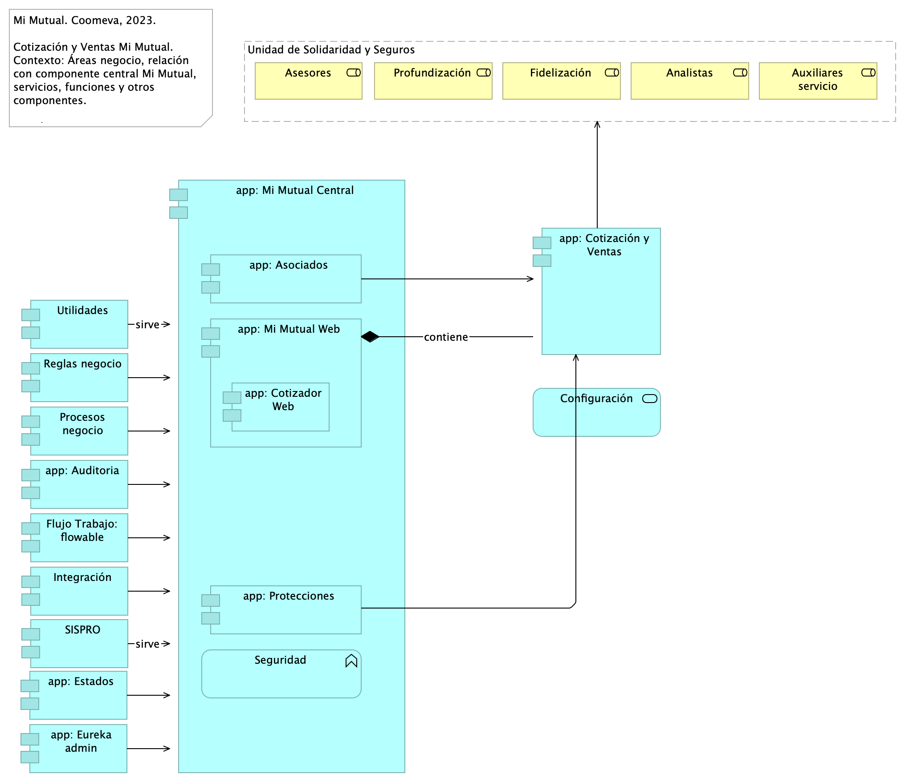
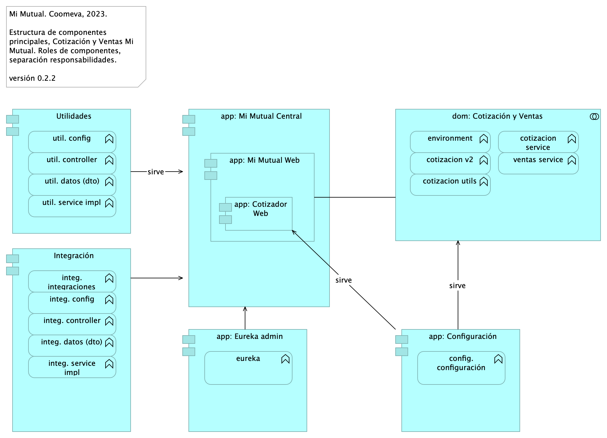
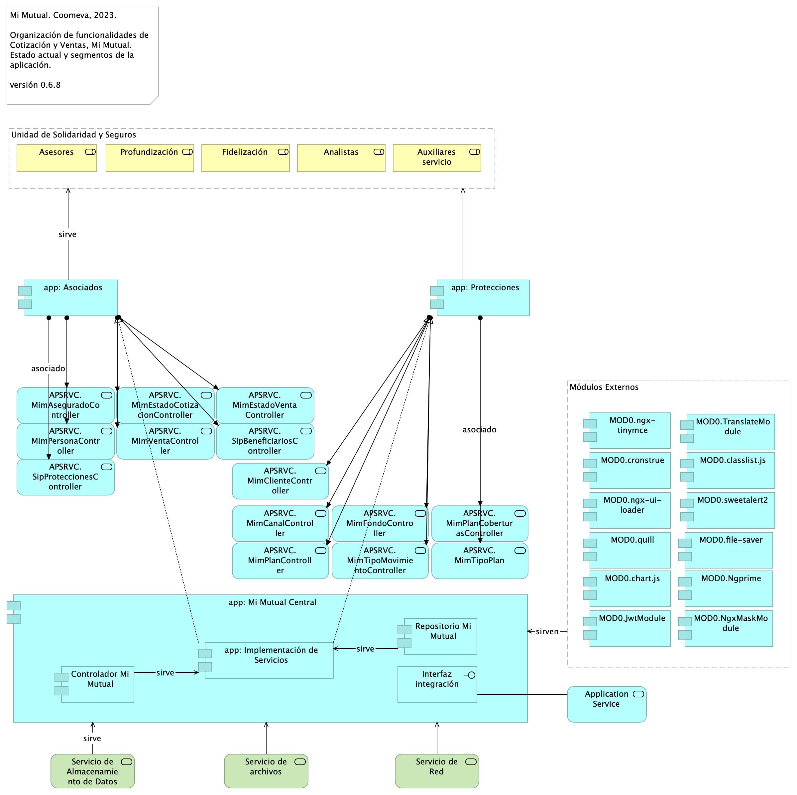
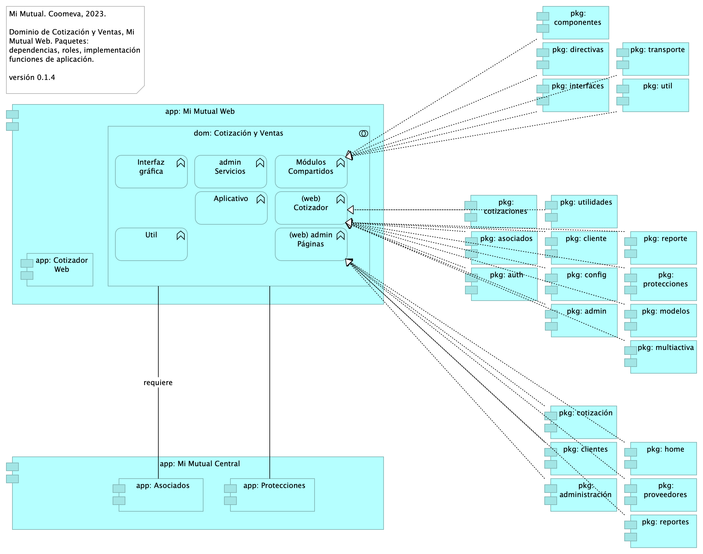
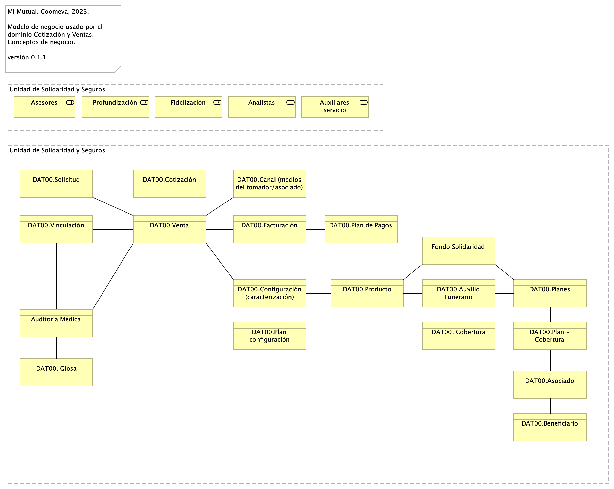
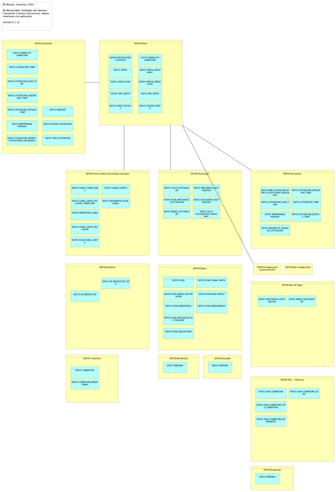

# Vista de Arquitectura Cotización y Ventas Mi Mutual
* [Ventas Mi Mutual Web](#ventas-mi-mutual-web)
	* [Ventas. 1. Contexto](#ventas.-1.-contexto)
	* [Ventas. 2. Contenedores](#ventas.-2.-contenedores)
	* [Ventas. 4. Aplicación](#ventas.-4.-aplicación)
	* [Ventas. 4a. Aplicación. Servicios](#ventas.-4a.-aplicación.-servicios)
	* [Ventas. 4b. Dependencias](#ventas.-4b.-dependencias)
	* [Ventas. 5. Físico. Despliegue](#ventas.-5.-físico.-despliegue)
	* [Ventas. 7a. Modelo Negocio](#ventas.-7a.-modelo-negocio)
	* [Ventas. 7. Datos. Negocio](#ventas.-7.-datos.-negocio)

\newpage

# Ventas Mi Mutual Web
## Ventas. 1. Contexto
{#fig:Ventas.1.Contexto width=}

### Contexto Cotización y Ventas Mi Mutual Web
La aplicación Ventas es parte Mi Mutual Web, que contiene a los módulos de interfaz web de Mi Mutual Central, que está representado por _app: Cotización y Ventas_ en el diagrama. Realizar (...)

En el contexto se aprecia a la aplicación de Cotización y Ventas junto a los módulos que permite realizar la composición de funcionalidades y organización de las partes a favor de extender la aplicación(es) con funcionalidades y los flujos de trabajo.

### Módulos Externos (adicionales al contexto)
Los módulos externos son las herramientas que se utilizan para complementar con funcionalidades ya desarrolladas y provenientes de un repositorio externo (NPM).

* TranslateModule: Manejo de internacionalización. Documentación: https://github.com/ngx-translate/core
* NgxMaskModule: Manejo de máscaras de input text. Documentación: https://github.com/JsDaddy/ngx-mask
* JwtModule: Manejo de token. Documentación: https://github.com/auth0/angular2-jwt
* sweetalert2: Manejo de alertas de mensajes. Documentación: https://sweetalert2.github.io/
* ngx-ui-loader: Manejo de Spinner para control de peticiones asíncronas. Documentación: https://github.com/t-ho/ngx-ui-loader
* Ngprime: Manejo de componentes visuales Documentación: https://www.primefaces.org/primeng/#/
* chart.js: componente utilizado para el manejo de graficas Documentación: https://www.chartjs.org/docs/latest/
* classlist.js: componete para el manejo de listas de datos en las gráficas Documentación: https://www.chartjs.org/docs/latest/
* cronstrue: componente para traducir una expresión cron a palabras Documentación: https://github.com/bradymholt/cronstrue
* file-saver: componente para descargar un archivo desde los bytes Documentación: https://github.com/eligrey/FileSaver.js#readme
* ngx-tinymce: Editor html para generación de plantillas para cartas Documentación: https://cipchk.github.io/ngx-tinymce/#/
* quill: componente para editor html Documentación: https://quilljs.com/

 

### Servicios Transversales (adicionales al contexto)

* AuthGuard: Validación de existencia de autenticación
* DeaciveGuard: Validación de salida de un componente
* ErrorInterceptor: Interceptor de Errores del back
* JwtInterceptor: Interceptor para inyectar el token
* AutenticationService: Métodos para completar la autenticación
* TypesService: Consumo de servicios de parametrización
* IdleTimeoutService: Verificación de timeout del token

 

### Catálogo de Elementos
| Nombre| Tipo| Descripción| Prop.
|:--------|:--------|:--------|:--------|
|**Flujo Trabajo: flowable**|application-component|Contiene todas las funcionalidades relacionadas con el motor de BPM Flowable, como gestión de tareas, instancias de nuevas procesos y asignación de tareas. |*modulo:* mimutual *alcanseSOA:* Fase 1.1 |
|**Integración**|application-component|Contiene todas las funcionalidades relacionadas con integraciones a otros servicios y otras bases de datos.|*modulo:* mimutual *alcanseSOA:* Fase 1.1 |
|**Procesos negocio**|application-component|Contiene todas las funcionalidades relacionadas con los flujos de JBPM, actualmente se hace solo para acceso a datos de la base de datos de JBPM.|*modulo:* mimutual |
|**Reglas negocio**|application-component|Contiene todas las funcionalidades relacionadas con la validación de reglas usadas en otros microservicios.|*modulo:* mimutual |
|**SISPRO**|application-component|Contiene todas las funcionalidades relacionadas con la autenticación y autorización al sistema Mi mutual (Este componente se adopta a la arquitectura de microservicios de MiMutual)|*modulo:* mimutual |
|**Utilidades**|application-component|Contiene todas las funcionalidades útiles y trasversales a los microservicios, como envío de correos, generación de archivos XSLX, PDF (Jasper) y consulta de parámetros.|*modulo:* mimutual |
|**app: Asociados**|application-component|Contiene todas las funcionalidades relacionadas con consulta y creación de asociados y beneficiarios.|*modulo:* mimutual |
|**app: Auditoria**|application-component|Contiene todas las funcionalidades relacionadas con el almacenamiento de la auditoria de las peticiones de la aplicación.|*modulo:* mimutual |
|**app: Cotización y Ventas**|application-component|||
|**app: Cotizador Web**|application-component|pkg: MiMutualWeb |*modulo:* cotizador |
|**app: Estados**|application-component|Administración de estados del portafolio. ||
|**app: Eureka admin**|application-component|Contiene todas las funcionalidades relacionadas con registrar y localizar microservicios existentes, informar de su localización, su estado y datos relevantes de cada uno de ellos. |*modulo:* mimutual *alcanseSOA:* Fase 1.1 |
|**app: Mi Mutual Central**|application-component|Antes SIPAS, Mi Mutual es una aplicación web compuesta por distintos módulos de software con arreglo a todas las actividades necesarias que soportan la operación de los productos y servicios que ofrece la Unidad de Solidaridad y Seguros de la Cooperativa.|*modulo:* mimutual |
|**app: Mi Mutual Web**|application-component|Portal de aplicaciones Mi Mutual Central. Interfaz gráfica web (HTML) de las aplicaciones de Mi Mutual. ||
|**app: Protecciones**|application-component|Contiene todas las funcionalidades relacionadas con la gestión y configuración de productos y protecciones.|*modulo:* mimutual |
|**Seguridad**|application-function|Software base. ||
|**Configuración**|application-service|Configuración o parametrización de factores para realizar los cálculos de las contribuciones de los asociados a la Cooperativa para cada uno de los productos adquiridos. ||
|**Analistas**|business-role|Analistas y auxiliares de servicio regional y nacional, agentes del centro de contacto, auditores médicos, analistas de operaciones (aseguramiento y facturación) y jefes.||
|**Asesores**|business-role|Asesores integrales||
|**Auxiliares servicio**|business-role|Analistas y auxiliares de servicio regional y nacional, agentes del centro de contacto, auditores médicos, analistas de operaciones (aseguramiento y facturación) y jefes.||
|**Fidelización**|business-role|Ejecutivos de Fidelización||
|**Profundización**|business-role|Ejecutivos de Profundización||
|**Unidad de Solidaridad y Seguros**|grouping|La Unidad de Solidaridad y Seguros cuenta con un software integrado para su core de negocio denominado SIPAS (Sistema de Previsión, Asistencia y Solidaridad)||

 

## Ventas. 2. Contenedores
{#fig:Ventas.2.Contenedores width=}

Especificación y organizción de contenedores principales de Cotización y Ventas Mi Mutual.

### Contenedores Principales Cotización y Ventas

* app: Cotización y Ventas
* app: Configuración
* app: Eureka admin
* submódulo Utilidades
* submódulo Integración
* app: Mi Mutual Central

 

### Catálogo de Elementos
| Nombre| Tipo| Descripción| Prop.
|:--------|:--------|:--------|:--------|
|**dom: Cotización y Ventas**|application-collaboration|Colaboración de servicios y funcionalidades que componen el dominio de Cotización y Ventas Mi Mutual. ||
|**Integración**|application-component|Contiene todas las funcionalidades relacionadas con integraciones a otros servicios y otras bases de datos.|*modulo:* mimutual *alcanseSOA:* Fase 1.1 |
|**Utilidades**|application-component|Contiene todas las funcionalidades útiles y trasversales a los microservicios, como envío de correos, generación de archivos XSLX, PDF (Jasper) y consulta de parámetros.|*modulo:* mimutual |
|**app: Configuración**|application-component|Contiene todas las funcionalidades útiles y trasversales a los microservicios, como envío de correos, generación de archivos XSLX, PDF (Jasper) y consulta de parámetros.|*modulo:* mimutual |
|**app: Cotizador Web**|application-component|pkg: MiMutualWeb |*modulo:* cotizador |
|**app: Eureka admin**|application-component|Contiene todas las funcionalidades relacionadas con registrar y localizar microservicios existentes, informar de su localización, su estado y datos relevantes de cada uno de ellos. |*modulo:* mimutual *alcanseSOA:* Fase 1.1 |
|**app: Mi Mutual Central**|application-component|Antes SIPAS, Mi Mutual es una aplicación web compuesta por distintos módulos de software con arreglo a todas las actividades necesarias que soportan la operación de los productos y servicios que ofrece la Unidad de Solidaridad y Seguros de la Cooperativa.|*modulo:* mimutual |
|**app: Mi Mutual Web**|application-component|Portal de aplicaciones Mi Mutual Central. Interfaz gráfica web (HTML) de las aplicaciones de Mi Mutual. ||
|**config. configuración**|application-function|||
|**cotizacion service**|application-function|||
|**cotizacion utils**|application-function|||
|**cotizacion v2**|application-function|||
|**environment**|application-function|||
|**eureka**|application-function|||
|**integ. config**|application-function|||
|**integ. controller**|application-function|||
|**integ. datos (dto)**|application-function|||
|**integ. integraciones**|application-function|||
|**integ. service impl**|application-function|||
|**util. config**|application-function|||
|**util. controller**|application-function|||
|**util. datos (dto)**|application-function|||
|**util. service impl**|application-function|||
|**ventas service**|application-function|||

 

## Ventas. 4. Aplicación
{#fig:Ventas.4.Aplicación width=}

La organización de la aplicación Cotización y Ventas, Mi Mutual, como capa de presentación y servicios, está planteada como una estructura basada en la referencia de aplicaciones Angular 12:

### Organización y Segmentos de la Aplicación Mi Mutual

1. Frontal / interfaz web
1. Servicios/ API
1. Central / modelo de negocio
1. Registros / modelo de datos y persistencia
1. Infraestructura

 

Las características de esta estructura (referida por Angular) está orientada al crecimiento (tamaño) de la aplicación, la escalabilidad y al rendimiento. La aplicación web Cotizador está diseñada (modulos) para manejar la carga por demanda del contenido.

### Dominio de Servicios Principales

* Asociados, contenido en el paquete app Asociados en el diagrama
* Protecciones, contenido en el paquete app Protecciones en el diagrama

 

### Catálogo de Elementos
| Nombre| Tipo| Descripción| Prop.
|:--------|:--------|:--------|:--------|
|**Controlador Mi Mutual**|application-component|Los componentes de este tipo se encargan de controlar los servicios rest de la aplicación, además en estos componentes se define la forma como se reciben y envían los datos de los servicios rest y la seguridad de cada uno de los métodos.|*modulo:* mimutual |
|**MOD0.JwtModule**|application-component| Manejo de token. Documentación: https://github.com/auth0/angular2-jwt||
|**MOD0.Ngprime**|application-component| Manejo de componentes visuales Documentación: https://www.primefaces.org/primeng/#/||
|**MOD0.NgxMaskModule**|application-component| Manejo de máscaras de input text. Documentación: https://github.com/JsDaddy/ngx-mask||
|**MOD0.TranslateModule**|application-component| Manejo de internacionalización. Documentación: https://github.com/ngx-translate/core||
|**MOD0.chart.js**|application-component| Componente utilizado para el manejo de graficas Documentación: https://www.chartjs.org/docs/latest/||
|**MOD0.classlist.js**|application-component|Componete para el manejo de listas de datos en las gráficas Documentación: https://www.chartjs.org/docs/latest/||
|**MOD0.cronstrue**|application-component| Componente para traducir una expresión cron a palabras Documentación: https://github.com/bradymholt/cronstrue||
|**MOD0.file-saver**|application-component| Componente para descargar un archivo desde los bytes Documentación: https://github.com/eligrey/FileSaver.js#readme||
|**MOD0.ngx-tinymce**|application-component|Editor html para generación de plantillas para cartas Documentación: https://cipchk.github.io/ngx-tinymce/#/||
|**MOD0.ngx-ui-loader**|application-component|Manejo de Spinner para control de peticiones asíncronas. Documentación: https://github.com/t-ho/ngx-ui-loader||
|**MOD0.quill**|application-component|Ccomponente para editor html Documentación: https://quilljs.com/||
|**MOD0.sweetalert2**|application-component|Manejo de alertas de mensajes. Documentación: https://sweetalert2.github.io/||
|**Repositorio Mi Mutual**|application-component|Antes SIPAS, Mi Mutual es una aplicación web compuesta por distintos módulos de software con arreglo a todas las actividades necesarias que soportan la operación de los productos y servicios que ofrece la Unidad de Solidaridad y Seguros de la Cooperativa. Para el manejo de la persistencia de datos se utilizará Spring Data el cual se apoya en la especificación de JPA y en la implementación de HIBERNATE además de complementar esta capa de persistencia con nuevas funcionalidades que facilitan el acceso a datos. |*modulo:* mimutual |
|**app: Asociados**|application-component|Contiene todas las funcionalidades relacionadas con consulta y creación de asociados y beneficiarios.|*modulo:* mimutual |
|**app: Implementación de Servicios**|application-component|Los componentes de este tipo se encargan de controlar y almacenar toda la lógica del negocio, validaciones y todo lo referente a procesamiento de datos. |*modulo:* mimutual |
|**app: Mi Mutual Central**|application-component|Antes SIPAS, Mi Mutual es una aplicación web compuesta por distintos módulos de software con arreglo a todas las actividades necesarias que soportan la operación de los productos y servicios que ofrece la Unidad de Solidaridad y Seguros de la Cooperativa.|*modulo:* mimutual |
|**app: Protecciones**|application-component|Contiene todas las funcionalidades relacionadas con la gestión y configuración de productos y protecciones.|*modulo:* mimutual |
|**Interfaz integración**|application-interface|Feign Client. Integración con otros sistemas para facilitar los procesos de vinculación, retiro, reactivación o fallecimiento de asociados.||
|**APSRVC. MimAseguradoController**|application-service|Servicios del contexto de Asociados, de Cotización y Ventas, Mi Mutual.||
|**APSRVC. MimCanalController**|application-service|Servicios del contexto de Protecciones, de Cotización y Ventas, Mi Mutual.||
|**APSRVC. MimClienteController**|application-service|Servicios del contexto de Protecciones, de Cotización y Ventas, Mi Mutual.||
|**APSRVC. MimEstadoCotizacionController**|application-service|Servicios del contexto de Asociados, de Cotización y Ventas, Mi Mutual.||
|**APSRVC. MimEstadoVentaController**|application-service|Servicios del contexto de Asociados, de Cotización y Ventas, Mi Mutual.||
|**APSRVC. MimFondoController**|application-service|Servicios del contexto de Protecciones, de Cotización y Ventas, Mi Mutual.||
|**APSRVC. MimPersonaController**|application-service|Servicios del contexto de Asociados, de Cotización y Ventas, Mi Mutual.||
|**APSRVC. MimPlanCoberturasController**|application-service|Servicios del contexto de Protecciones, de Cotización y Ventas, Mi Mutual.||
|**APSRVC. MimPlanController**|application-service|Servicios del contexto de Protecciones, de Cotización y Ventas, Mi Mutual.||
|**APSRVC. MimTipoMovimientoController**|application-service|Servicios del contexto de Protecciones, de Cotización y Ventas, Mi Mutual.||
|**APSRVC. MimTipoPlan**|application-service|Servicios del contexto de Protecciones, de Cotización y Ventas, Mi Mutual.||
|**APSRVC. MimVentaController**|application-service|Servicios del contexto de Asociados, de Cotización y Ventas, Mi Mutual.||
|**APSRVC. SipBeneficiariosController**|application-service|Servicios del contexto de Asociados, de Cotización y Ventas, Mi Mutual.||
|**APSRVC. SipProteccionesController**|application-service|Servicios del contexto de Asociados, de Cotización y Ventas, Mi Mutual.||
|**Application Service**|application-service|Otros servicios del contexto de Mi Mutual Central. ||
|**Analistas**|business-role|Analistas y auxiliares de servicio regional y nacional, agentes del centro de contacto, auditores médicos, analistas de operaciones (aseguramiento y facturación) y jefes.||
|**Asesores**|business-role|Asesores integrales||
|**Auxiliares servicio**|business-role|Analistas y auxiliares de servicio regional y nacional, agentes del centro de contacto, auditores médicos, analistas de operaciones (aseguramiento y facturación) y jefes.||
|**Fidelización**|business-role|Ejecutivos de Fidelización||
|**Profundización**|business-role|Ejecutivos de Profundización||
|**Módulos Externos**|grouping|||
|**Unidad de Solidaridad y Seguros**|grouping|La Unidad de Solidaridad y Seguros cuenta con un software integrado para su core de negocio denominado SIPAS (Sistema de Previsión, Asistencia y Solidaridad)||
|**Servicio de Almacenamiento de Datos**|technology-service|||
|**Servicio de Red**|technology-service|||
|**Servicio de archivos**|technology-service|||

 

## Ventas. 4a. Aplicación. Servicios
{#fig:Ventas.4a.Aplicación.Servicios width=}

Composición interna de los servivios de Mi Mutual Central, Mi Mutual Web, Cotizador Web. La vista muestra el patron de diseño con el que están implementados los servicios de la aplicación.

### Catálogo de Elementos
| Nombre| Tipo| Descripción| Prop.
|:--------|:--------|:--------|:--------|
|**Controlador**|application-component|Controlador interno del servicio. Punto de entrada a la lógica de expuesta.||
|**Interfaz**|application-component|Interfaz de inversión de dependencia a las clases del servicio. ||
|**Interfaz datos**|application-component|Acceso a datos del modelo del contexto de Mi Mutual Central. ||
|**Operación**|application-component|||
|**Servicio**|application-component|Exposición de componentes de negocio. ||
|**Interfaz integración**|application-interface|Feign Client. Integración con otros sistemas para facilitar los procesos de vinculación, retiro, reactivación o fallecimiento de asociados.||
|**Application Service**|application-service|Otros servicios del contexto de Mi Mutual Central. ||
|**Gestión de Productos**|application-service|Gestión de productos del fondo mutual y auxilio funerario que involucran lo relacionado a las siguientes coberturas: * Fondo de Solidaridad: Incapacidades temporales, Incapacidades Permanentes (total, parcial), Perseverancia 60, 62, 65, 70 años, Perseverancias Anticipadas, Fallecimiento Asociado (Auxilio por muerte), Desempleo, Disminución de ingresos y enfermedades graves; Rentas por hospitalización, Enfermedades de Alto Costo, Pólizas de seguros personales y patrimoniales, Planes educativos, Segunda opinión médica, Asistencias. * Auxilio Funerario: Fallecimiento de familiares directos (inscritos) del Asociado. ||
|**Integración**|application-service|||

 

## Ventas. 4b. Dependencias
{#fig:Ventas.4b.Dependencias width=}

### Paquetes y Dependencias del dominio Cotización y Ventas

Módulos y componentes de Mi Mutual relacionados con el dominio de colaboración Cotización y Ventas. Estos paquetes y desplegables hacen parte de las dependencias del dominio y son una especie de estructura de la aplicación (basado en Angular 12 [^1]).

[^1]: Angular 2 tiene una arquitectura Modelo Vista Controlador (MVC) con el fin de facilitar el desarrollo gestionado.

### Módulos del Dominio Cotización y Ventas
La estructura por módulos actual apunta a la escalabilidad y mantenimiento del dominio Cotización y Ventas en términos de organizar las partes de la aplicación, organizar los bloques, extender la aplicación con libreras externas, proporcionar un entorno de resolución de plantillas y además, distribuir las cargas de los componentes y servicios que usa la aplicación.

### Catálogo de Elementos
| Nombre| Tipo| Descripción| Prop.
|:--------|:--------|:--------|:--------|
|**dom: Cotización y Ventas**|application-collaboration|Colaboración de servicios y funcionalidades que componen el dominio de Cotización y Ventas Mi Mutual. ||
|**app: Asociados**|application-component|Contiene todas las funcionalidades relacionadas con consulta y creación de asociados y beneficiarios.|*modulo:* mimutual |
|**app: Cotizador Web**|application-component|pkg: MiMutualWeb |*modulo:* cotizador |
|**app: Mi Mutual Central**|application-component|Antes SIPAS, Mi Mutual es una aplicación web compuesta por distintos módulos de software con arreglo a todas las actividades necesarias que soportan la operación de los productos y servicios que ofrece la Unidad de Solidaridad y Seguros de la Cooperativa.|*modulo:* mimutual |
|**app: Mi Mutual Web**|application-component|Portal de aplicaciones Mi Mutual Central. Interfaz gráfica web (HTML) de las aplicaciones de Mi Mutual. ||
|**app: Protecciones**|application-component|Contiene todas las funcionalidades relacionadas con la gestión y configuración de productos y protecciones.|*modulo:* mimutual |
|**pkg: admin**|application-component|controller: Almacenan todas las clases que constituyen los servicios rest de la aplicación.|*modulo:* cotizador |
|**pkg: administración**|application-component|admin controller: Almacenan todas las clases que constituyen los servicios REST de la administrción de la aplicación.|*modulo:* cotizador |
|**pkg: asociados**|application-component|controller: Almacenan todas las clases que constituyen los servicios rest de la aplicación.|*modulo:* cotizador |
|**pkg: auth**|application-component|controller: Almacenan todas las clases que constituyen los servicios rest de la aplicación.|*modulo:* cotizador |
|**pkg: cliente**|application-component|controladores web de cliente. Reúne las clases que constituyen el modelo de entrada/salida de la interfaz gráfica de Clientes. Distinto al paquete admin controlador Clientes (pkg: web.clientes). |*modulo:* cotizador |
|**pkg: clientes**|application-component|admin controller: Almacenan todas las clases que constituyen los servicios REST de la administrción de la aplicación. Disitnto al paquete web de Cliente (pkg: admin.cliente).|*modulo:* cotizador |
|**pkg: componentes**|application-component|controller: contiene las clases que constituyen los llamados a librerías compartidas de la aplicación.|*modulo:* cotizador |
|**pkg: config**|application-component|controller: Almacenan todas las clases que constituyen los servicios rest de la aplicación.|*modulo:* cotizador |
|**pkg: cotizaciones**|application-component|controller: Almacenan todas las clases que constituyen los servicios rest de la aplicación.|*modulo:* cotizador |
|**pkg: cotización**|application-component|admin controller: Almacenan todas las clases que constituyen los servicios REST de la administrción de la aplicación.|*modulo:* cotizador |
|**pkg: directivas**|application-component|controller: contiene las clases que constituyen los llamados a librerías compartidas de la aplicación.|*modulo:* cotizador |
|**pkg: home**|application-component|admin controller: Almacenan todas las clases que constituyen los servicios REST de la administrción de la aplicación.|*modulo:* cotizador |
|**pkg: interfaces**|application-component|controller: contiene las clases que constituyen los llamados a librerías compartidas de la aplicación.|*modulo:* cotizador |
|**pkg: modelos**|application-component|controller: Almacenan todas las clases que constituyen los servicios rest de la aplicación.|*modulo:* cotizador |
|**pkg: multiactiva**|application-component|controller: Almacenan todas las clases que constituyen los servicios rest de la aplicación.|*modulo:* cotizador |
|**pkg: protecciones**|application-component|controller: Almacenan todas las clases que constituyen los servicios rest de la aplicación.|*modulo:* cotizador |
|**pkg: proveedores**|application-component|admin controller: Almacenan todas las clases que constituyen los servicios REST de la administrción de la aplicación.|*modulo:* cotizador |
|**pkg: reporte**|application-component|controller: Almacenan todas las clases que constituyen los servicios rest de la aplicación.|*modulo:* cotizador |
|**pkg: reportes**|application-component|admin controller: Almacenan todas las clases que constituyen los servicios REST de la administrción de la aplicación.|*modulo:* cotizador |
|**pkg: transporte**|application-component|controller: contiene las clases que constituyen los llamados a librerías compartidas de la aplicación.|*modulo:* cotizador |
|**pkg: util**|application-component|controller: contiene las clases que constituyen los llamados a librerías compartidas de la aplicación.|*modulo:* cotizador |
|**pkg: utilidades**|application-component|controller: Almacenan todas las clases que constituyen los servicios rest de la aplicación.|*modulo:* cotizador |
|**(web) Cotizador**|application-function|Grupo de páginas web del cotizador. |*modulo:* cotizador |
|**(web) admin Páginas**|application-function|Grupo de páginas web del cotizador. |*modulo:* cotizador |
|**Aplicativo**|application-function|Grupo de funcionalidades y entidades (datos) específicas del Cotizador Web. |*modulo:* cotizador |
|**Interfaz gráfica**|application-function|Módulo interno (carpeta de proyecto) contenedor de las plantiilas de páginas web del Cotizador. |*modulo:* cotizador |
|**Módulos Compartidos**|application-function|Librerías de software base que el Cotizador Web requiere. Dependencias a paquetes de software de base, distintas a los módulos de negocio, necesarios para la ejecución de tareas utilitarias del Cotizador, tales como comunicación, políticas de seguridad, especificación de objetos globales de interfaz, transporte, transformación, entre otras. |*modulo:* cotizador |
|**Util**|application-function|En la Utilidades se especifican las clases que complementan una funcionalidad de un componente o servicio. * FormValidate: Clase que implementa un disparador de validación de todos los campos de un formulario. * CustomValidators: Creación de validaciones de campos.   |*modulo:* cotizador |
|**admin Servicios**|application-function||*modulo:* cotizador |

 

## Ventas. 5. Físico. Despliegue
{#fig:Ventas.5.Físico.Despliegue width=}

### Especificaciones de Despliegue Cotizador Web
Detalles de configuración del proyecto Mi Mutual en el espacio de trabajo servidor y local (2022), librerías de desarrollo (frameworks), lenguajes, instalaciones y sus versiones.

Especificaciones de despliegue Mi Mutual, 2023, Componente Central y Cotizador Web.

* Estándares para el manejo de servicios REST sobre HTTP 1.1
* Tecnologías para el backend: Java 8 con Spring Boot 2.1.4
* Acceso a Datos: Spring Data 2.1.4
* Seguridad de las API: Spring Security + Oauth2.0
* Plataforma de despliegue Backend: Tomcat Spring Boot
* Tecnologías para el frontend Mi Mutual Central: Angular 9
* Tecnologías para el frontend Cotizador Web: Angular 14
* Entorno de ejecución Javascript: nodejs 14.2.0
* Librería de Estilos Bootstrap 4.x
* Servidor web (HTTP 1.1): Apache 2.x
* Servidor BPM, Flowable, versión 6.5.0 con JRE 8
* Spring Cloud, versión Greenwich SR2
* Querydsl, version 4.2.1
* Bases de datos IBM DB2, AS400

 

#### Recursos y Herramientas Requeridas
* Git. Se debe instalar git para poder realizar la clonación de cada uno de los proyectos mas adelante.
* SmartGit. Se debe instalar Smartgit para poder realizar la clonación de cada uno de los proyectos mas adelante, este es opcional ya que es una interfaz gráfica de git mas amigable para el usuario en caso que no desee trabajar con la consola.
* DBeaver. Se debe instalar DBeaver para poder acceder a la base de datos. 
* Instalación Maven. Se debe instalar maven para poder compilar los proyectos, nos debemos asegurar de instalar la versión 3.6.3, en caso que no se encuentra en la página oficial copiar la carpeta que esta en el repositorio a archivo de programas. 
* Java 8. Se debe instalar Java para poder desplegar los proyectos mas adelante, nos debemos asegurar de instalar la versión 8. 
* STS. Se debe instalar el IDE para realizar modificaciones a los proyectos back mas adelante en este caso Spring Tools 4 for Eclipse. La carpeta que genera el instalador la copiamos a archivos de programa. 
* Instalación Lombok. Se debe instalar el lombok seleccionando el IDE que acabamos de instarlar en este caso el STS.
* Postman. Se debe instalar el postman para poder consumir los servicios del backend mas adelante cuando ya se hayan desplegado.
* Node Js. Se debe instalar Node Js para configurar el proyecto front mas adelante, nos debemos asegurar de instalar la versión v14.2.0.
* Visual Studio Code. Se debe instalar el IDE para realizar modificaciones al proyecto front mas adelante en este caso Visual Studio code. 
* Librería para desarrollo frontend Cotizador Web: Angular 14

 

| Nota: los paquetes con el mismo nombre, como pkg: cliente, y pkg: clientes que aparecen arriba en el diagrama corresponden a espacio de nombres distintos. Por ejemplo, para el caso de estos dos paquetes, pkg: cliente pertenece el espacio de nombre (web) Cotizador; en cambio, pkg: clientes pertenece al espacio de nombres (web) admin Páginas.

 

### Catálogo de Elementos
| Nombre| Tipo| Descripción| Prop.
|:--------|:--------|:--------|:--------|
|**dom: Cotización y Ventas**|application-collaboration|Colaboración de servicios y funcionalidades que componen el dominio de Cotización y Ventas Mi Mutual. ||
|**app: Asociados**|application-component|Contiene todas las funcionalidades relacionadas con consulta y creación de asociados y beneficiarios.|*modulo:* mimutual |
|**app: Implementación de Servicios**|application-component|Los componentes de este tipo se encargan de controlar y almacenar toda la lógica del negocio, validaciones y todo lo referente a procesamiento de datos. |*modulo:* mimutual |
|**app: Mi Mutual Web**|application-component|Portal de aplicaciones Mi Mutual Central. Interfaz gráfica web (HTML) de las aplicaciones de Mi Mutual. ||
|**app: Protecciones**|application-component|Contiene todas las funcionalidades relacionadas con la gestión y configuración de productos y protecciones.|*modulo:* mimutual |
|**app: Reclamaciones**|application-component|Contiene todas las funcionalidades relacionadas con la gestión de reclamaciones, liquidaciones y pagos.|*modulo:* mimutual |
|**pkg: admin**|application-component|controller: Almacenan todas las clases que constituyen los servicios rest de la aplicación.|*modulo:* cotizador |
|**pkg: administración**|application-component|admin controller: Almacenan todas las clases que constituyen los servicios REST de la administrción de la aplicación.|*modulo:* cotizador |
|**pkg: asociados**|application-component|controller: Almacenan todas las clases que constituyen los servicios rest de la aplicación.|*modulo:* cotizador |
|**pkg: auth**|application-component|controller: Almacenan todas las clases que constituyen los servicios rest de la aplicación.|*modulo:* cotizador |
|**pkg: cliente**|application-component|controladores web de cliente. Reúne las clases que constituyen el modelo de entrada/salida de la interfaz gráfica de Clientes. Distinto al paquete admin controlador Clientes (pkg: web.clientes). |*modulo:* cotizador |
|**pkg: clientes**|application-component|admin controller: Almacenan todas las clases que constituyen los servicios REST de la administrción de la aplicación. Disitnto al paquete web de Cliente (pkg: admin.cliente).|*modulo:* cotizador |
|**pkg: config**|application-component|controller: Almacenan todas las clases que constituyen los servicios rest de la aplicación.|*modulo:* cotizador |
|**pkg: cotizaciones**|application-component|controller: Almacenan todas las clases que constituyen los servicios rest de la aplicación.|*modulo:* cotizador |
|**pkg: cotización**|application-component|admin controller: Almacenan todas las clases que constituyen los servicios REST de la administrción de la aplicación.|*modulo:* cotizador |
|**pkg: home**|application-component|admin controller: Almacenan todas las clases que constituyen los servicios REST de la administrción de la aplicación.|*modulo:* cotizador |
|**pkg: modelos**|application-component|controller: Almacenan todas las clases que constituyen los servicios rest de la aplicación.|*modulo:* cotizador |
|**pkg: multiactiva**|application-component|controller: Almacenan todas las clases que constituyen los servicios rest de la aplicación.|*modulo:* cotizador |
|**pkg: protecciones**|application-component|controller: Almacenan todas las clases que constituyen los servicios rest de la aplicación.|*modulo:* cotizador |
|**pkg: proveedores**|application-component|admin controller: Almacenan todas las clases que constituyen los servicios REST de la administrción de la aplicación.|*modulo:* cotizador |
|**pkg: reporte**|application-component|controller: Almacenan todas las clases que constituyen los servicios rest de la aplicación.|*modulo:* cotizador |
|**pkg: reportes**|application-component|admin controller: Almacenan todas las clases que constituyen los servicios REST de la administrción de la aplicación.|*modulo:* cotizador |
|**pkg: utilidades**|application-component|controller: Almacenan todas las clases que constituyen los servicios rest de la aplicación.|*modulo:* cotizador |
|**Conexión: jdbc**|artifact||*modulo:* cotizador |
|**Spring Boot 2.1.4**|artifact|Librerías backend Spring Boot 2.1.4 para Java 8. |*brecha:* 30 |
|**Spring Data 2.1.4**|artifact|Librerías backend Spring Boot 2.1.4 para Java 8. |*brecha:* 30 |
|**Entorno Angular: ng 14.0.0**|system-software||*modulo:* cotizador |
|**Entorno Java: JRE 1.8**|system-software||*brecha:* 30 *:*  |
|**Repositorio: db2 iSerie**|system-software||*modulo:* cotizador |
|**cotizador Entorno JS: node 14.2.0**|system-software||*modulo:* cotizador |
|**mimutual Servicios: tomcat**|system-software||*modulo:* mimutual |

 

## Ventas. 7a. Modelo Negocio
{#fig:Ventas.7a.ModeloNegocio width=}

Modelo de negocio (lógico) de Mi Mutual, Mi Mutual Web, extensible a sus demás módulos, como el dominio Cotización y Ventas, el Cotizador Web y otros. 

Los actores de la Unidad de Solidaridad y Seguros de Coomeva relacionados con el dominio de Cotización y Ventas, son entre otros, Asesores, Analistas, Auxiliares.

Por otra parte, el modelo de negocio Mi Mutual relacionado con el dominio  el dominio de Cotización y Ventas contiene los conceptos de negocio que se encuentran implementados en Mi Mutual Central y Mi Mutual Web: reglas y funciones de negocio, y el modelo(s) de datos del sistema.

### Conceptos Principales del Dominio Cotización y Ventas

1. Venta
1. Cotización
1. Configuración
1. Vinculación
1. Factura
1. Cobertura
1. Configuración
1. Plan de producto

### Orden Operativo

1. Configuración
1. Vinculación
1. Venta o Cotización
1. Factura

 

### Relación Negocio Datos
La relación entre los conceptos de negocio y el modelo de datos se encuentra en la vista Cotizador. 7. Datos. Negocio.

### Catálogo de Elementos
| Nombre| Tipo| Descripción| Prop.
|:--------|:--------|:--------|:--------|
|**Auditoría Médica**|business-object|Cuando se glosa una solicitus es porque el auditor medico necesita mas informacion y la reasigna. ||
|**DAT00. Cobertura**|business-object|||
|**DAT00. Glosa**|business-object|Cuando se glosa una solicitus es porque el auditor medico necesita mas informacion y la reasigna. ||
|**DAT00.Asociado**|business-object|||
|**DAT00.Auxilio Funerario**|business-object|||
|**DAT00.Beneficiario**|business-object|||
|**DAT00.Canal (medios del tomador/asociado)**|business-object|||
|**DAT00.Configuración (caracterización)**|business-object|Caracterización de productos, planes, parámetros ||
|**DAT00.Cotización**|business-object|||
|**DAT00.Facturación**|business-object|Factura la genera COOMEVA. ||
|**DAT00.Plan - Cobertura**|business-object|||
|**DAT00.Plan configuración**|business-object|Plan de configuración: producto pólizas seguros. ||
|**DAT00.Plan de Pagos**|business-object|||
|**DAT00.Planes**|business-object|||
|**DAT00.Producto**|business-object|||
|**DAT00.Solicitud**|business-object|Caracterización de productos, planes, parámetros ||
|**DAT00.Venta**|business-object|||
|**DAT00.Vinculación**|business-object|||
|**Fondo Solidaridad**|business-object|||
|**Analistas**|business-role|Analistas y auxiliares de servicio regional y nacional, agentes del centro de contacto, auditores médicos, analistas de operaciones (aseguramiento y facturación) y jefes.||
|**Asesores**|business-role|Asesores integrales||
|**Auxiliares servicio**|business-role|Analistas y auxiliares de servicio regional y nacional, agentes del centro de contacto, auditores médicos, analistas de operaciones (aseguramiento y facturación) y jefes.||
|**Fidelización**|business-role|Ejecutivos de Fidelización||
|**Profundización**|business-role|Ejecutivos de Profundización||
|**Unidad de Solidaridad y Seguros**|grouping|La Unidad de Solidaridad y Seguros cuenta con un software integrado para su core de negocio denominado SIPAS (Sistema de Previsión, Asistencia y Solidaridad)||
|**Unidad de Solidaridad y Seguros**|grouping|La Unidad de Solidaridad y Seguros cuenta con un software integrado para su core de negocio denominado SIPAS (Sistema de Previsión, Asistencia y Solidaridad)||

 

## Ventas. 7. Datos. Negocio
{#fig:Ventas.7.Datos.Negocio width=}

La relación del modelo de negocio Mi Mutual con el modelo de datos del Cotizador Web orienta la navegación en el modelo de datos en aquellas historias de usuario que impliquen a alguna de estas entidades.

Este modelo de relación negocio-datos es evolutivo: irá cambiando en la medida de que el negocio o el modelo de datos cambien.

### Entidades de Negocio Mi Mutual
Dominios de datos de negocio. Entidades independiente de la plataforma y de la tecnología.

* Configuración (caracterización de productos, plan)
* Plan (producto pólizas seguros)
* Canal (medios del tomador/asociado)
* Parametros globales (catálogos)
* Portafolio de asociado
* Asociado
* Facturación
* Beneficiario

 

### Catálogo de Elementos
| Nombre| Tipo| Descripción| Prop.
|:--------|:--------|:--------|:--------|
|**DAT00. Cobertura**|business-object|||
|**DAT00.Asegurado**|business-object|||
|**DAT00.Asociado**|business-object|||
|**DAT00.Beneficiario**|business-object|||
|**DAT00.Canal (medios del tomador/asociado)**|business-object|||
|**DAT00.Configuración (caracterización)**|business-object|Caracterización de productos, planes, parámetros ||
|**DAT00.Cotización**|business-object|||
|**DAT00.Facturación**|business-object|Factura la genera COOMEVA. ||
|**DAT00.Plan - Cobertura**|business-object|||
|**DAT00.Plan configuración**|business-object|Plan de configuración: producto pólizas seguros. ||
|**DAT00.Plan de Pagos**|business-object|||
|**DAT00.Planes**|business-object|||
|**DAT00.Producto**|business-object|||
|**DAT00.Venta**|business-object|||
|**DAT00.Vinculación**|business-object|||
|**DAT01.CANAL_CONFIG_MOV**|data-object|||
|**DAT01.CANAL_EVENTO**|data-object|||
|**DAT01.CANAL_VENTA_EXCLUSION**|data-object|||
|**DAT01.CANAL_VENTA_EXCLUSION_COBERTURA**|data-object|||
|**DAT01.CICLO FACTURACION CONFIG MOV**|data-object|||
|**DAT01.CICLO_FACTURACION**|data-object|||
|**DAT01.COBERTURA**|data-object|||
|**DAT01.COBERTURA_BENEFICIARIO**|data-object|||
|**DAT01.COTIZACION_APORTE_ESTATUTARIO_ASEGURADO**|data-object|||
|**DAT01.COTIZACION_ASEGURADO_TEMP**|data-object|||
|**DAT01.COTIZACION_ASEGURADO_TEMP**|data-object|||
|**DAT01.COTIZACION_DETALLE_TEMP**|data-object|||
|**DAT01.COTIZACION_DETALLE_TEMP**|data-object|||
|**DAT01.COTIZACION_PLAN_TEMP**|data-object|||
|**DAT01.COTIZACION_PLAN_TEMP**|data-object|||
|**DAT01.COTIZACION_TEMP**|data-object|||
|**DAT01.COTIZACION_TEMP**|data-object|||
|**DAT01.ESTADO_COTIZACION**|data-object|||
|**DAT01.ESTADO_VENTA**|data-object|||
|**DAT01.FRECUENCIA_FACTURACION**|data-object|||
|**DAT01.FRECUENCIA_FACTURACION**|data-object|||
|**DAT01.MEDIO_FACTURACION**|data-object|||
|**DAT01.MEDIO_FACTURACION**|data-object|||
|**DAT01.MIM_COTIZACION_APORTE_ESTATUTARIO_ASEGURADO**|data-object|||
|**DAT01.MOVIMIENTO_PLAN_CANAL**|data-object|||
|**DAT01.PERSONA**|data-object|||
|**DAT01.PERSONA**|data-object|||
|**DAT01.PERSONA**|data-object|||
|**DAT01.PERSONA**|data-object|||
|**DAT01.PLAN**|data-object|||
|**DAT01.PLAN NIVEL RIESGO**|data-object|||
|**DAT01.PLAN_CANAL_VENTA**|data-object|||
|**DAT01.PLAN_CANAL_VENTA**|data-object|||
|**DAT01.PLAN_COBERTURA**|data-object|||
|**DAT01.PLAN_COBERTURA_DEPENDIENTE**|data-object|||
|**DAT01.PLAN_COBERTURA_EDAD**|data-object|||
|**DAT01.PLAN_COBERTURA_TIPO_COBERTURA**|data-object|||
|**DAT01.PLAN_FRECUENCIA_FACTURACION**|data-object|||
|**DAT01.PLAN_FRECUENCIA_FACTURACION**|data-object|||
|**DAT01.PLAN_MEDIO_FACTURACION**|data-object|||
|**DAT01.PLAN_MEDIO_FACTURACION**|data-object|||
|**DAT01.PLAN_OBLIGATORIO**|data-object|||
|**DAT01.PLAN_PARENTESCO**|data-object|||
|**DAT01.PLAN_PERSEVERANTE**|data-object|||
|**DAT01.PRE_VENTA**|data-object|||
|**DAT01.PRODUCTO COBERTURA**|data-object|||
|**DAT01.PRODUCTO COBERTURA**|data-object|||
|**DAT01.PROMOTOR_CANAL**|data-object|||
|**DAT01.PROSPECTO_ASOCIADO_COTIZACION**|data-object|||
|**DAT01.RESPONSABLE PERSONA**|data-object|||
|**DAT01.RESPONSABLE PERSONA**|data-object|||
|**DAT01.SIP_PRODUCTOS**|data-object|||
|**DAT01.SIP_PRODUCTOS_TIPO**|data-object|||
|**DAT01.TIPO_COTIZACION**|data-object|||
|**DAT01.TIPO_VENTA**|data-object|||
|**DAT01.VENTA**|data-object|||
|**DAT01.VENTAS_PREGUNTAS**|data-object|||
|**DAT01.VENTA_ASEGURADO**|data-object|||
|**DAT01.VENTA_DETALLE**|data-object|||
|**DAT01.VENTA_PLAN**|data-object|||
|**DATO2.PROTECCIONES_EVENTOS**|data-object|||

 

``Generated on: Tue Dec 19 2023 23:40:43 GMT-0500 (COT)``